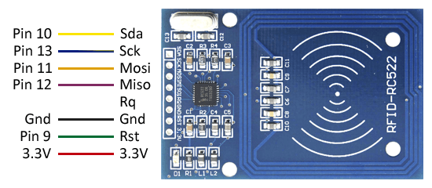

# Lector De Tarjetas con ServoMotor
Este programa usa un lector RFID, Arduino y ServoMotor para poder simular una apertura de seguridad, donde el Arduino conoce el codigo de una tarjeta que es leida por el Lector RFID y si el codigo es correcto, el servomotor realiza las instrucciones propuestas, el servomotor se puede reemplazar por cualquier dispositivo siempre y cuando se configure correctamente.

Para este proyecto se requiere:
* Arduino UNO
* [Arduino IDE](https://www.arduino.cc/en/Main/Software)
* Lector RFID MFRC522 (Lector de tarjetas)
* ServoMotor

### Configuracion de la libreria de MFRC52252
Una vez tengamos instalado el IDE de Arduino, debemos añadir la libreria que nos permitira usar el MFRC522, para esto iremos al repositorio de GitHub de [miguelbalboa/rfid](https://github.com/miguelbalboa/rfid), ubicaremos el boton de *clone or download* y lo descargaremos como ZIP. Despues de tener el ZIP descargado, abriremos del IDE de Arduino anteriormente instalado, en la barra del menu iremos a *Programa>Incluir libreria>Añadir libreria .ZIP* y seleccionaremos el .ZIP descargado anteriormente del repositorio; finalmente reiniciaremos el IDE de Arduino.

### Esquema de conexion MFRC522 a Arduino UNO
En este caso, el MFRC522 viene con una tarjeta RFID y un llavero azul que tambien funciona como RFID.

El siguiente es el esquema de como se conectara el Lector RFID a la placa de Arduino UNO, los numeros de los pines son recomendaciones, usted puede colocarlos en los pines deseados siempre y cuando correspondan a los mismos indicados en el archivo *.ino*


#### Identificar ID de dispositivo

Para identificar el `knownTac` que se describe en el codigo de *servoRFID.ino*, podemos incluir el siguiente codigo
```ino
for(byte i=0; i<mfrc522.uid.size;i++){
  Serial.print(mfrc522.uid.uidByte[i]<0x10 ? "0":" ");
  Serial.print(mfrc522.uid.uidByte[i],DEC);
}
```
Es importante realizar este paso antes de poder implementar el funcionamiento del servoMotor. Esta implementacion del codigo se encuentra en el archivo  *getTac.ino*

### ServoMotor SG90
Para el codigo propuesto en este proyecto, se usa un servoMotor de referencia [SG90](http://www.ee.ic.ac.uk/pcheung/teaching/DE1_EE/stores/sg90_datasheet.pdf), este ira conectado al pin digital **4**, este se puede cambiar siempre y cuando se cambie en el archivo *.ino*.

### Codigo en Funcionamiento
- Descargar ambos archivos *.ino*
- Abrir *getTac.ino*
- En la barra de menu: *Heramientas>Placa: >Arduino/Genuino Uno*
- En la barra de menu: *Heramientas>Puerto: > *COMx**
- Subimos el codigo a la placa
- Abrimos el serial (Lupa en la esquina superior derecha)
- Acercamos la Tarjera RFID al Lector MFRC522
- Copiamos los 4 numeros que debio imprimir el serial(xxx xxx xxx xxx)
 - Cerramos *getTac.ino* y abrimos *servoRFID.ino*
 - En la variable `knownTac` reemplazamos el valor por los digitos obtenidos anteriormente, es decir `byte knownTac[4] = {xxx,xxx,xxx,xxx};`
 - Subimos el codigo a la placa

 Para verificar que todo funcione correctamente, acercamos la tarjeta identificada en el *getTac.ino* y el servomotor debe realizar las instrucciones implementadas, luego acercamos el otro dispositivo RFID no identificado y el servomotor no debe actuar.